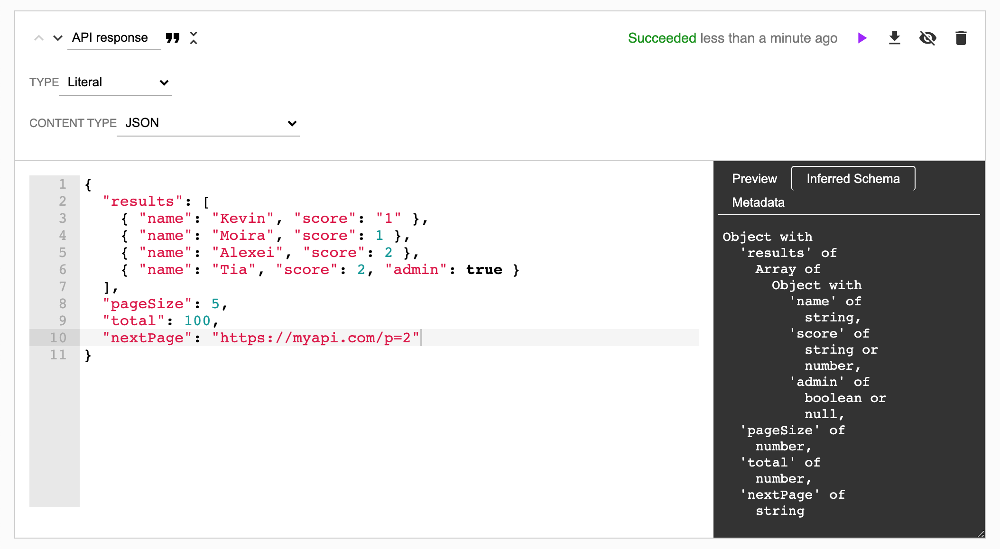

# Shape

This library provides an inference of object shape given a JavaScript
data object. It probably won't work well with circular references. But
any object that comes from JSON will not have circular references.

It works well on very small or very large objects due to sampling
(which can be turned off if requested).

You can try it out online in the [DataStation app](https://app.datastation.multiprocess.io/).



## Install

```bash
$ yarn add @multiprocess/shape
```

## Examples

```javascript
import { shape, toString } from '@multiprocess/shape';

const schema = shape({
  "results": [
    { "name": "Kevin", "score": "1" },
    { "name": "Moira", "score": 1 },
    { "name": "Alexei", "score": 2 },
    { "name": "Tia", "score": 2, "admin": true }
  ],
  "pageSize": 5,
  "total": 100,
  "nextPage": "https://myapi.com/p=2",
});
console.log(JSON.stringify(schema, null, 2), toString(schema));
```

Will print out:

```
{    
  "kind": "object",
  "children": {
    "results": {
      "kind": "array",
      "children": {
        "kind": "object",
        "children": {
          "name": {
            "kind": "scalar",
            "name": "string"
          },      
          "score": {
            "kind": "varied",
            "children": [
              {
                "kind": "scalar",
                "name": "string"
              },
              {
                "kind": "scalar",
                "name": "number"
              }
            ]
          },
          "admin": {
            "kind": "scalar",
            "name": "boolean"
          }
        }
      }
    },
    "pageSize": {
      "kind": "scalar",
      "name": "number"
    },
    "total": {
      "kind": "scalar",
      "name": "number"
    },
    "nextPage": {
      "kind": "scalar",
      "name": "string"
    },
  }
} Object with
  'results' of
    Array of
      Object with
        'name' of
          string,
        'score' of
          string or
          number,
        'admin' of
          boolean,
  'pageSize' of
    number,
  'total' of
    number,
  'nextPage' of
    string
```

## Sampling

This library defaults to checking up to only 5000 elements at any
level which allows the inferrence to scale to very large datasets. It
will pick up to N elements randomly with the object to sample. To
disable this, pass `null`, `undefined`, or `false` as the second
argument to `shape`. For example `shape(data, false)`.

However, turning off sampling will eventually wreck your stack as you
pass bigger objects to `shape`.

## License

Apache-2.0, see [./LICENSE.md](./LICENSE.md).
